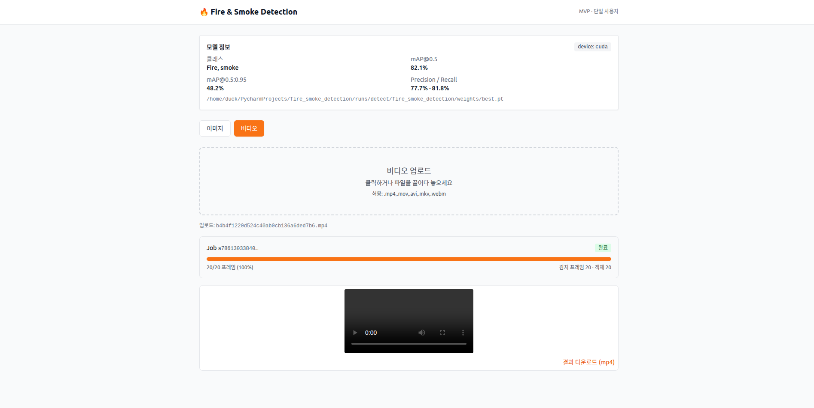

# 🔥 Fire & Smoke Detection

YOLOv8 기반 화재 · 연기 실시간 감지 웹 애플리케이션.

브라우저에서 이미지/비디오를 업로드하면 **FastAPI** 백엔드가 **Ultralytics YOLOv8** 모델로 감지를 수행하고, **React + Vite** 프론트엔드가 결과를 시각화한다. 학습/검증은 별도 CLI로 실행한다.

[](https://www.python.org/)
[](https://fastapi.tiangolo.com/)
[](https://react.dev/)
[](https://github.com/ultralytics/ultralytics)
[](https://www.gnu.org/licenses/agpl-3.0)

<p align="left">
  
</p>

---

## ✨ 주요 기능

- **이미지 감지** — 동기 추론, 어노테이트 결과 + 감지 테이블 즉시 표시
- **비디오 감지** — 비동기 잡 큐 + 800ms 폴링, 진행률/감지 통계 실시간 갱신, mp4 다운로드
- **모델 정보 카드** — 디바이스, mAP@0.5, mAP@0.5:0.95, Precision/Recall 표시
- **GPU 자동 감지** — CUDA 사용 가능 시 GPU, 아니면 CPU 폴백
- **GPU 직렬화** — `asyncio.Lock` 으로 단일 사용자 MVP의 GPU 점유 정리
- **CLI 학습 파이프라인** — Roboflow 데이터셋 다운로드 → 학습 → 검증 일괄

> 🗂️ 자세한 설계는 [`docs/architecture.md`](docs/architecture.md), [`docs/uml.md`](docs/uml.md) 참고.

---

## 🧱 프로젝트 구조

```
fire_smoke_detection/
├── backend/                     # FastAPI 서버 + ML 파이프라인
│   ├── main.py                  # FastAPI 진입점 (모델 사전 로드)
│   ├── cli.py                   # 학습/검증/추론 CLI
│   ├── config.py                # 전역 설정 (경로/클래스/모델 크기)
│   ├── schemas.py               # Pydantic 응답 모델
│   ├── data.yaml                # Ultralytics 데이터셋 설정
│   ├── requirements.txt
│   ├── routes/                  # HTTP 라우터 (detect, jobs, model)
│   ├── services/                # 도메인 서비스 (inference 싱글톤, job 큐)
│   ├── storage/                 # uploads / results / jobs (런타임 생성)
│   ├── inference_engine.py      # YOLO 추론 래퍼
│   ├── model_trainer.py         # 학습
│   ├── model_validator.py       # 검증 + 메트릭
│   ├── dataset_manager.py       # 데이터셋 구조 관리
│   └── ...
│
├── frontend/                    # React + Vite SPA
│   ├── src/
│   │   ├── App.tsx              # 탭 UI (이미지 / 비디오)
│   │   ├── pages/               # ImageDetect, VideoDetect
│   │   ├── components/          # DropZone, JobProgress, DetectionTable, ModelInfoCard
│   │   ├── api/client.ts        # fetch 래퍼
│   │   └── types.ts             # 백엔드 schemas.py 의 TS 미러
│   ├── vite.config.ts           # /api → 127.0.0.1:8000 프록시
│   └── package.json
│
├── datasets/                    # 학습 데이터셋 (Roboflow)
├── runs/                        # 학습 산출물 (Ultralytics)
└── docs/                        # 아키텍처 · UML 문서
```

---

## 🚀 빠른 시작 (웹 앱 실행)

### 1) 백엔드 — FastAPI

```bash
cd backend
python -m venv .venv
source .venv/bin/activate          # Windows: .venv\Scripts\activate
pip install -r requirements.txt

# 최초 1회: 학습된 가중치(best.pt) 가 runs/detect/.../weights/ 아래 있어야 함
# 없으면 yolov8n.pt 사전훈련 모델로 폴백 (정확도 낮음)

uvicorn main:app --host 0.0.0.0 --port 8000 --reload
```

기본 엔드포인트:

| 메서드 | 경로 | 설명 |
| --- | --- | --- |
| `GET`  | `/api/health` | 헬스체크 |
| `GET`  | `/api/model/info` | 모델 메타 + 메트릭 |
| `POST` | `/api/detect/image` | 이미지 감지 (≤20MB) |
| `POST` | `/api/detect/video` | 비디오 감지 잡 생성 (≤200MB) |
| `GET`  | `/api/jobs/{id}` | 잡 상태/진행률 |
| `GET`  | `/api/jobs/{id}/result` | 결과 비디오 다운로드 |
| `GET`  | `/api/files/{name}` | 어노테이트 파일 서빙 |

OpenAPI: <http://localhost:8000/docs>

### 2) 프론트엔드 — Vite Dev Server

```bash
cd frontend
npm install
npm run dev    # http://localhost:5173
```

Vite의 `/api` 프록시가 자동으로 `http://127.0.0.1:8000` 으로 포워딩한다.

### 3) 사용

1. <http://localhost:5173> 접속
2. 상단 카드에 모델 정보가 표시되는지 확인
3. **이미지** 탭: 드롭존에 파일 업로드 → 결과 + 감지 테이블 표시
4. **비디오** 탭: 파일 업로드 → 진행률 폴링 → 완료 후 재생/다운로드

---

## 🛠️ 학습 / 검증 (CLI)

웹 앱과는 별개로 `backend/cli.py` 가 학습·검증·CLI 추론을 통합 제공한다.

### 전체 파이프라인 (다운로드 → 학습 → 검증)

```bash
cd backend
python cli.py --mode full \
  --download quick \
  --api-key $ROBOFLOW_API_KEY \
  --epochs 50 \
  --batch-size 16
```

### 단계별 실행

```bash
# 환경 점검 (GPU/패키지/data.yaml)
python cli.py --mode setup

# 데이터셋 다운로드 (Roboflow)
python cli.py --mode dataset --download quick --api-key $ROBOFLOW_API_KEY

# 학습
python cli.py --mode train --epochs 100 --batch-size 16 --model-size yolov8n.pt

# 검증 → backend/test_validation_report.json 생성
python cli.py --mode validate

# CLI 추론
python cli.py --mode infer --source path/to/image.jpg --inference-type image
python cli.py --mode infer --source path/to/video.mp4 --inference-type video
python cli.py --mode infer --inference-type realtime           # 웹캠
```

학습이 끝나면 `runs/detect/fire_smoke_detection/weights/best.pt` 가 생성되고, 다음 백엔드 부팅 시 자동으로 로드된다.

---

## ⚙️ 설정

### 클래스

`backend/config.py` 의 `Config.CLASS_NAMES = ['Fire', 'smoke']` 가 학습/추론/응답 전체의 단일 소스.

### 모델 검색 순서 (`InferenceEngine.load_model`)

1. `runs/detect/fire_smoke_detection/weights/best.pt`
2. `runs/detect/train/weights/best.pt`
3. `yolov8n.pt` (사전훈련 폴백)

### YOLO 모델 크기 (`--model-size`)

| 모델 | 파라미터 | 권장 용도 |
| --- | --- | --- |
| `yolov8n.pt` | 3.2M | 실시간/저사양 (기본값) |
| `yolov8s.pt` | 11.2M | 균형 |
| `yolov8m.pt` | 25.9M | 정확도 우선 |
| `yolov8l.pt` | 43.7M | 고정확도 |
| `yolov8x.pt` | 68.2M | 연구용 |

### 업로드 한도 (`backend/routes/detect.py`)

- 이미지: 20MB / `.jpg .jpeg .png .bmp .webp`
- 비디오: 200MB / `.mp4 .mov .avi .mkv .webm`

초과 시 HTTP 413.

### CORS

기본은 Vite 개발 서버(`http://localhost:5173`)만 허용. 운영 도메인 추가는 `backend/main.py` 의 `CORSMiddleware` 의 `allow_origins` 수정.

---

## 🧩 아키텍처 요약

```
Browser (React SPA · Vite 5173)
        │  fetch /api/*  (vite proxy)
        ▼
FastAPI (uvicorn :8000)
        │
   ┌────┴───────────────────────┐
   ▼                            ▼
 routes/                    services/
  detect.py  ────────────►   inference.py  (InferenceEngine singleton)
  jobs.py    ────────────►   jobs.py       (in-memory queue + asyncio.Lock)
  model.py
        │
        ▼
inference_engine.py  →  Ultralytics YOLOv8  →  PyTorch (CUDA / CPU)
        │
        ▼
 backend/storage/{uploads,results}     runs/detect/.../best.pt
```

핵심 설계 포인트:

- **싱글톤 엔진**: 앱 lifespan에서 모델을 1회 로드, 모든 요청이 공유 (`services/inference.py`).
- **GPU 직렬화**: 모듈 레벨 `asyncio.Lock` 으로 이미지/비디오 추론을 직렬 처리 → 단일 사용자 MVP의 GPU OOM 방지.
- **비동기 잡 + 폴링**: 비디오는 `asyncio.create_task` + in-memory `_jobs` dict, 매 5프레임마다 진행률 갱신.
- **동기 호출 격리**: Ultralytics는 동기이므로 `asyncio.to_thread` 로 워커 스레드에서 실행 → 이벤트 루프 비차단.

자세한 다이어그램은 [`docs/uml.md`](docs/uml.md) 참고.

---

## 📈 검증 메트릭

`python cli.py --mode validate` 실행 시 `backend/test_validation_report.json` 이 생성되고, 백엔드의 `/api/model/info` 응답에 자동 포함된다. 프론트엔드 `ModelInfoCard` 가 이를 시각화한다.

수집되는 메트릭: `map50`, `map50_95`, `precision`, `recall`.

---

## 🐛 문제 해결

### 모델 로드 실패 → "best.pt 확인"
가중치가 없거나 잘못된 경로. 학습을 먼저 수행하거나, 미리 학습된 `best.pt` 를 `runs/detect/fire_smoke_detection/weights/` 에 배치.

### CUDA OOM
- 배치 크기 축소: `python cli.py --mode train --batch-size 8`
- 비디오 추론은 이미 stream 모드이지만, 동시 요청은 `_infer_lock` 으로 직렬화됨.

### CORS / 프록시 오류
- 브라우저 콘솔에 CORS 에러 → `backend/main.py` 의 `allow_origins` 확인.
- `npm run dev` 가 5173이 아닌 다른 포트로 뜨면 백엔드 CORS 도 같이 수정.

### Roboflow 다운로드 실패
- API 키 확인: <https://roboflow.com> → Settings → API Keys
- 수동: `python instant_download.py`

---

## 🔗 참고 자료

- [Ultralytics YOLOv8 문서](https://docs.ultralytics.com/)
- [FastAPI](https://fastapi.tiangolo.com/)
- [Vite](https://vitejs.dev/) · [TailwindCSS](https://tailwindcss.com/)
- 추천 데이터셋: [Roboflow Fire-WRPGM](https://universe.roboflow.com/custom-thxhn/fire-wrpgm/dataset/8)

---

## 📄 라이선스

본 프로젝트는 **AGPL-3.0** 을 따른다. YOLOv8(Ultralytics) 의 라이선스를 상속하므로, 네트워크 서비스로 배포 시에도 소스 공개 의무가 발생할 수 있다. 상업적 사용을 검토한다면 Ultralytics의 [Enterprise License](https://www.ultralytics.com/license) 를 확인할 것.
