# UML 다이어그램 (UML Diagrams)

> Fire & Smoke Detection — 컴포넌트/클래스/시퀀스/상태/배포 다이어그램

본 문서는 [Mermaid](https://mermaid.js.org/) 기반 UML 다이어그램을 모은다. GitHub/IDE 마크다운 프리뷰에서 그대로 렌더링된다.

---

## 1. 컴포넌트 다이어그램 (시스템 수준)

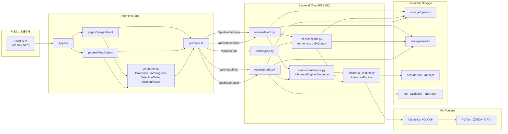

---

## 2. 클래스 다이어그램 — Backend Core

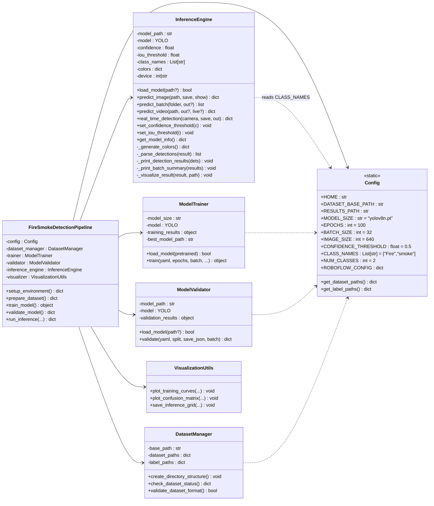

---

## 3. 클래스 다이어그램 — Backend API Layer

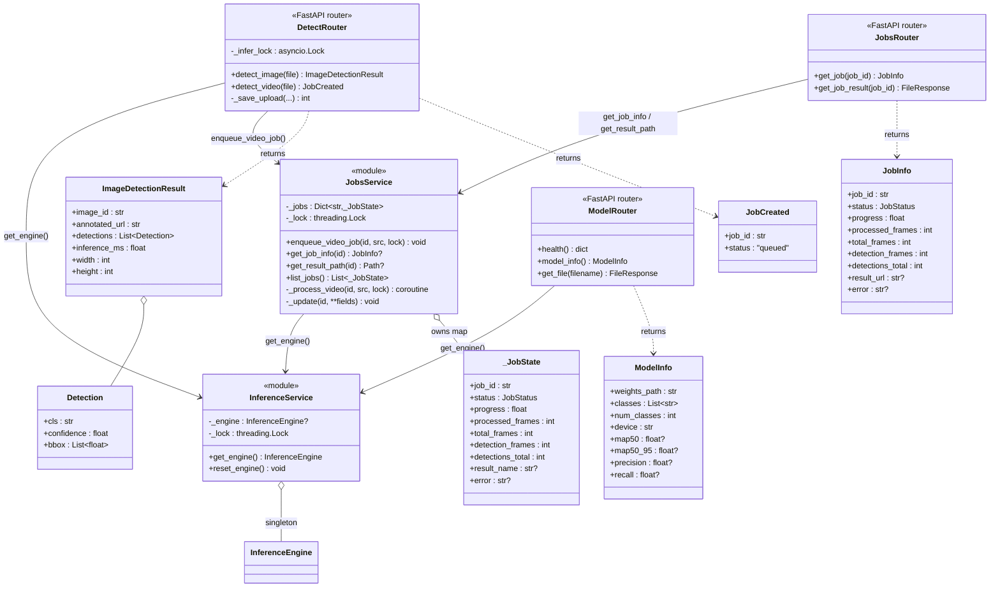

---

## 4. 클래스 다이어그램 — Frontend

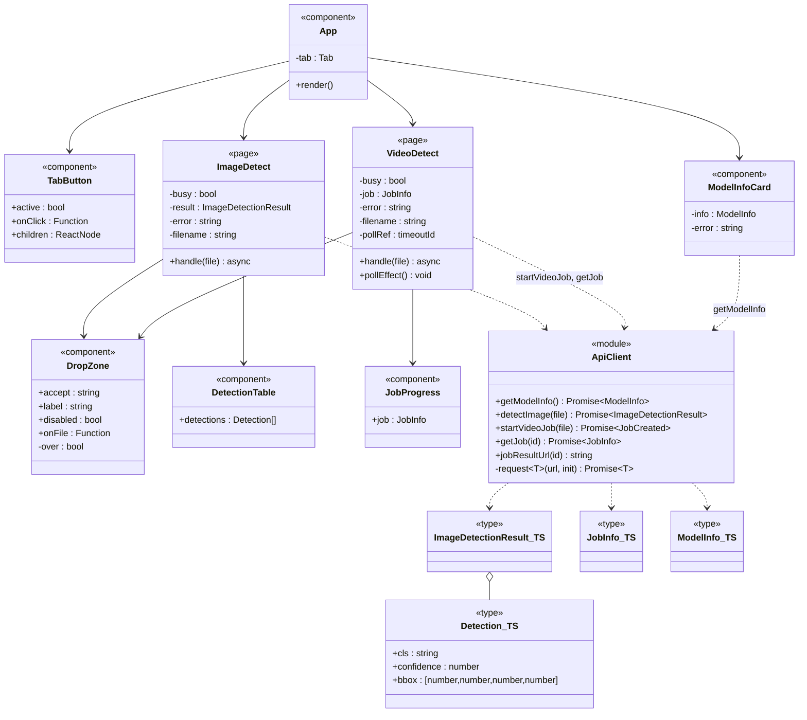

---

## 5. 시퀀스 다이어그램 — 이미지 감지

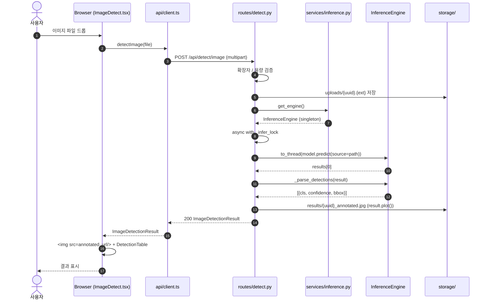

---

## 6. 시퀀스 다이어그램 — 비디오 감지 (비동기 잡 + 폴링)

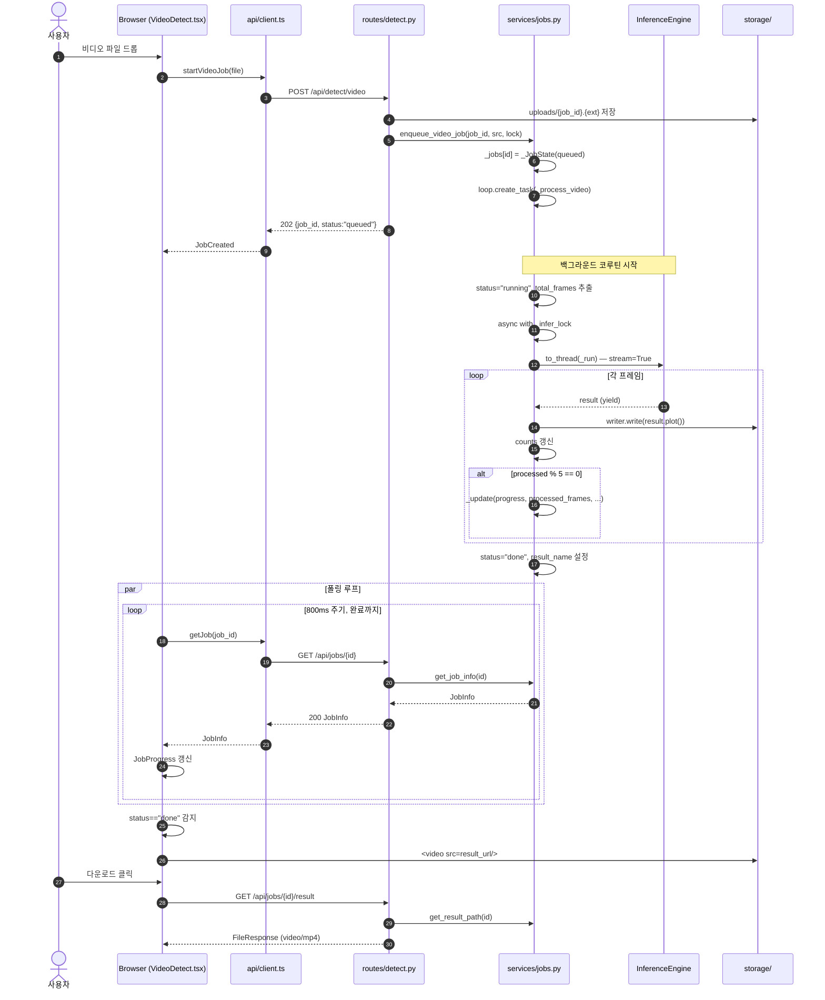

---

## 7. 시퀀스 다이어그램 — 모델 정보 조회

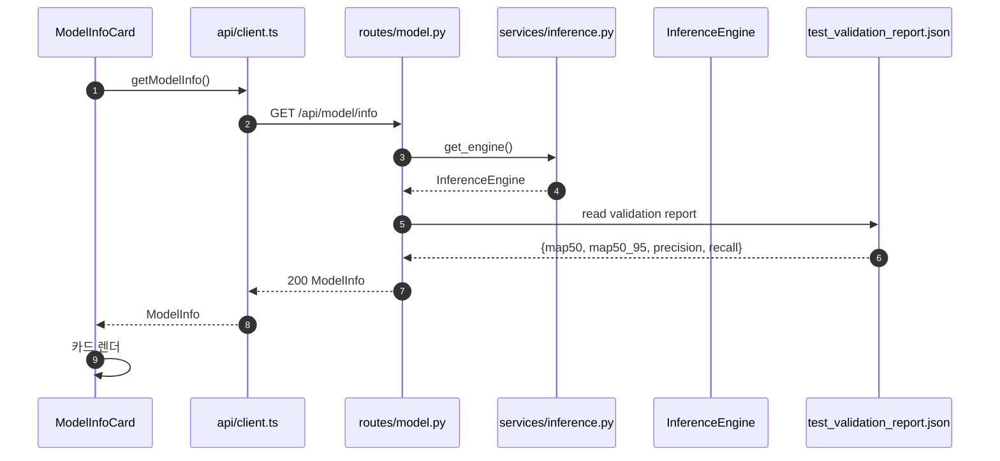

---

## 8. 상태 다이어그램 — 비디오 잡 라이프사이클

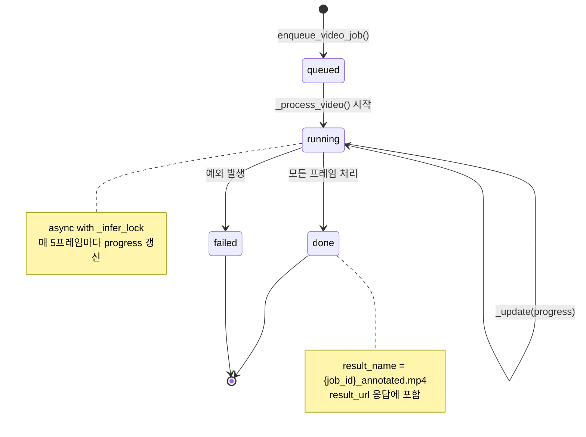

---

## 9. 상태 다이어그램 — Frontend 페이지 상태

### 9.1 ImageDetect

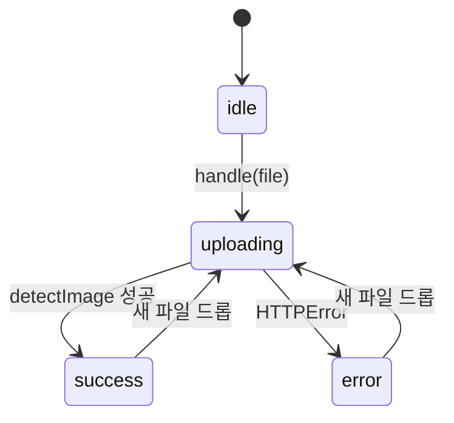

### 9.2 VideoDetect

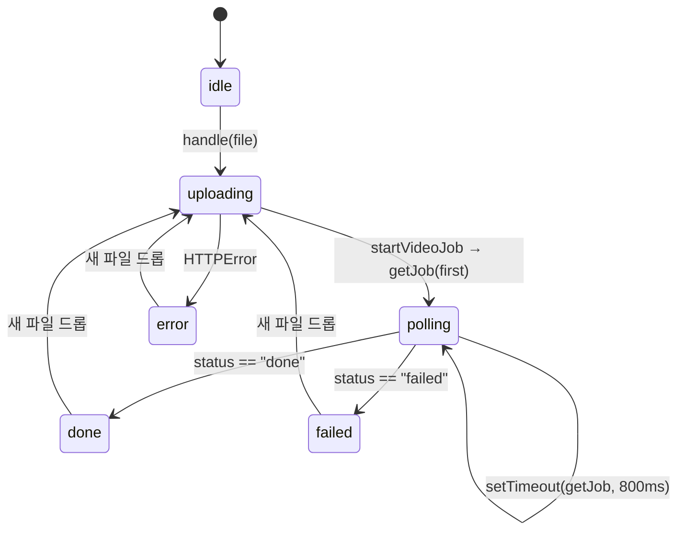

---

## 10. 시퀀스 다이어그램 — 학습 파이프라인 (CLI)

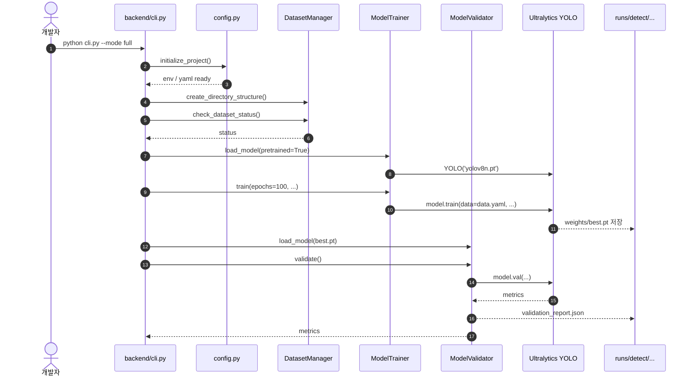

---

## 11. 배포 다이어그램 (개발 환경)

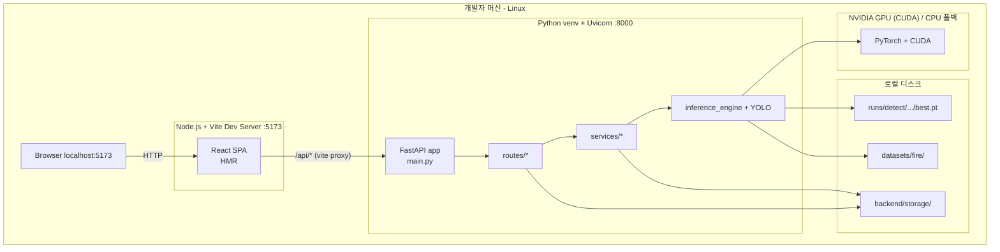

---

## 12. API 시퀀스 요약 (엔드포인트 매트릭스)

| 메서드 | 경로 | 입력 | 출력 | 비고 |
| --- | --- | --- | --- | --- |
| GET | `/` | — | `{name, version}` | 헬스용 루트 |
| GET | `/api/health` | — | `{status:"ok"}` | 헬스체크 |
| GET | `/api/model/info` | — | `ModelInfo` | 메트릭은 `test_validation_report.json` 기반 |
| GET | `/api/files/{filename}` | path | binary | uploads/results 자동 탐색 |
| POST | `/api/detect/image` | multipart `file` | `ImageDetectionResult` | 20MB 한도, 동기 |
| POST | `/api/detect/video` | multipart `file` | `JobCreated` 202 | 200MB 한도, 비동기 잡 |
| GET | `/api/jobs/{job_id}` | path | `JobInfo` | 폴링용 |
| GET | `/api/jobs/{job_id}/result` | path | `FileResponse` mp4 | status=="done"만 |

---

## 13. 데이터 모델 (Pydantic ↔ TypeScript)

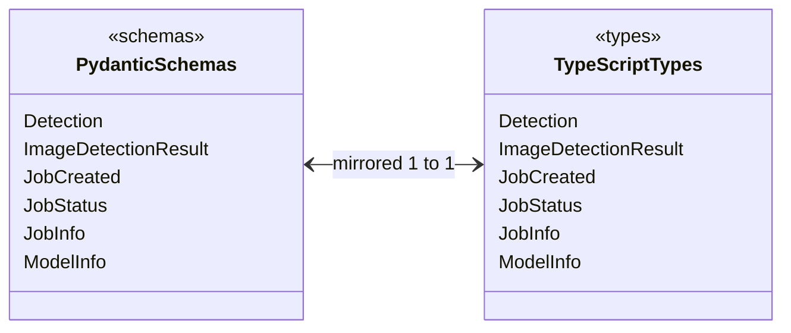

> 백엔드 `backend/schemas.py`와 프론트엔드 `frontend/src/types.ts`는 1:1로 미러링된다. 한쪽 변경 시 반드시 다른 쪽도 갱신할 것.
